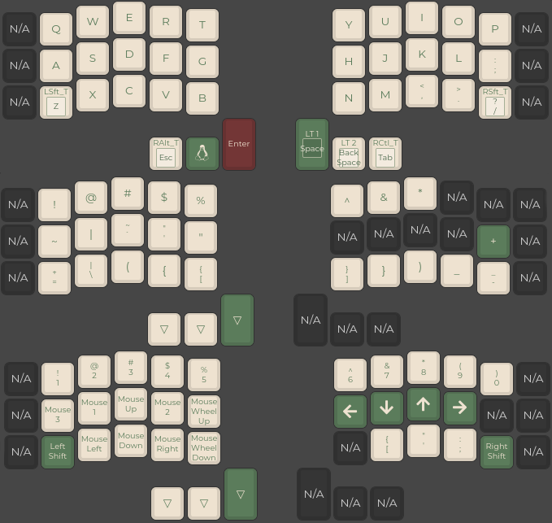

# chocofi 36 key keboard

## Layout

## How to create and compile

I use [config.qmk.fm](https://config.qmk.fm/#/crkbd/rev1/LAYOUT_split_3x6_3) to create the .json. Ignore the outer columns. 
Then i use `qmk json2c layout.json > keymap.c` to make the keymap 
Move the file to `qmk_firmware/keyboards/crkbd/keymap/your_name/keymap.c` 
Then you use `qmk compile -kb crkbd/rev1 -km soew -e CONVERT_TO=promicro_rp2040` to compile it to a .uf2 file.

